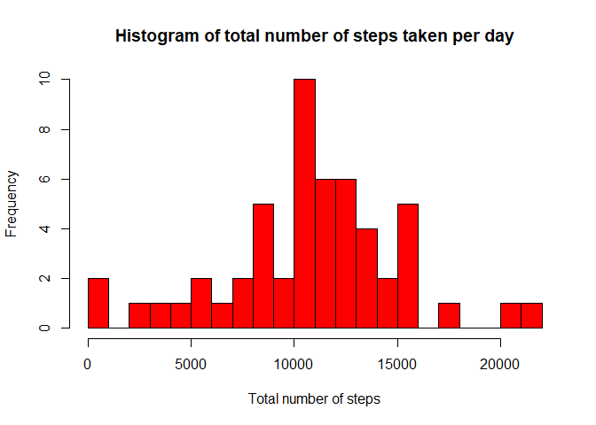
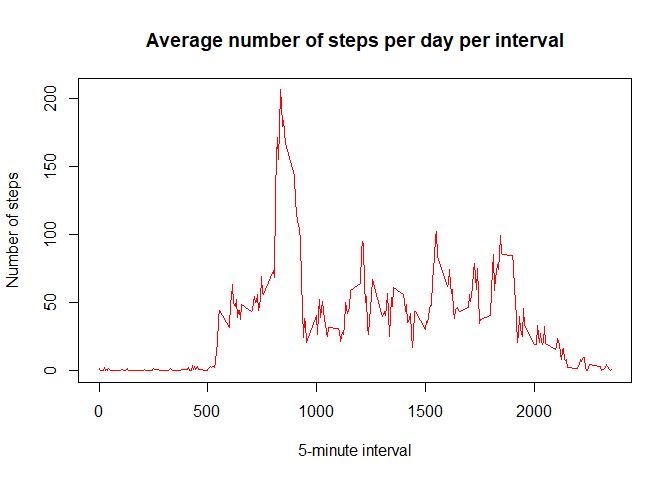
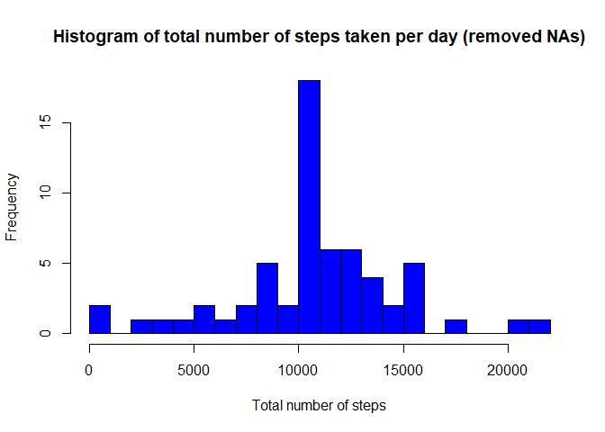
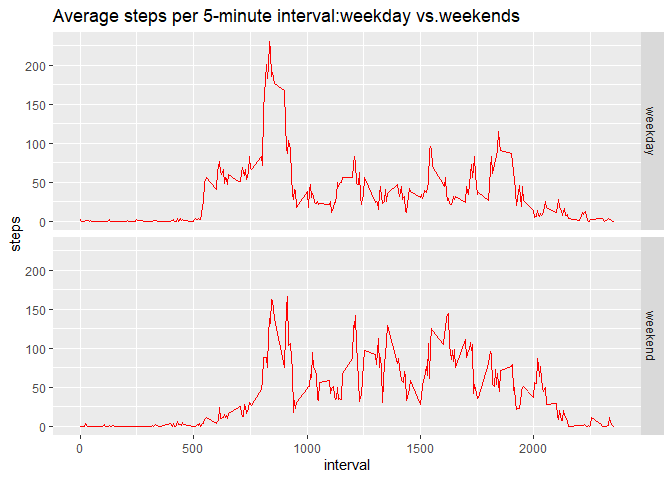

Introduction
------------

This is an R markdown document, created for the Coursera: Reproduciable
Research Peer Assessment 1. The assignment requires students to write an
R markdown document evidencing literate programming, using markdown and
R programming techniques. There are 5 primary questions to be answered,
dealing with processing and analysing data. The data provided to be
worked upon, is called “activity monitoring data”.

Data used in the analysis
-------------------------

Data used in the anaysis is collected from a personal activity
monitoring device. This device collects data at 5 minute intervals
through out the day. The data consists of two months of data from an
anonymous individual collected during the months of October and
November, 2012 and include the number of steps taken in 5 minute
intervals each day.

### The Assigment

Loading and preprocessing the data
----------------------------------

    activity=read.csv("activity.csv", stringsAsFactors = FALSE)
    str(activity)

    ## 'data.frame':    17568 obs. of  3 variables:
    ##  $ steps   : int  NA NA NA NA NA NA NA NA NA NA ...
    ##  $ date    : chr  "2012-10-01" "2012-10-01" "2012-10-01" "2012-10-01" ...
    ##  $ interval: int  0 5 10 15 20 25 30 35 40 45 ...

    activity$date <- as.Date(activity$date, "%Y-%m-%d")
    head(activity)

    ##   steps       date interval
    ## 1    NA 2012-10-01        0
    ## 2    NA 2012-10-01        5
    ## 3    NA 2012-10-01       10
    ## 4    NA 2012-10-01       15
    ## 5    NA 2012-10-01       20
    ## 6    NA 2012-10-01       25

What is mean total number of steps taken per day?
-------------------------------------------------

Calculate the total number of steps taken per day. Ignore NAs

    library(dplyr)

    ## 
    ## Attaching package: 'dplyr'

    ## The following objects are masked from 'package:stats':
    ## 
    ##     filter, lag

    ## The following objects are masked from 'package:base':
    ## 
    ##     intersect, setdiff, setequal, union

    steps <- aggregate(steps~date, data=activity, sum)

Making a histogram of the total number of steps taken each day:

Calculate the mean and median of the total number of steps taken per
day:

    mean(steps$steps)

    ## [1] 10766.19

    median(steps$steps)

    ## [1] 10765

What is the average daily acitivity pattern?
--------------------------------------------

Calculate the average daily pattern

    steps_ave <- aggregate(steps~interval, activity,mean)

Time series plot of 5 minut intervals and average number od steps taken

5-minute interval with the maxium number of steps (on average)

    steps_ave[which.max(steps_ave$steps),1]

    ## [1] 835

Imputing missing values
-----------------------

Total number of missing values in the dataset

    anyNA(activity)

    ## [1] TRUE

    sum(is.na(activity))

    ## [1] 2304

    colSums(is.na(activity))

    ##    steps     date interval 
    ##     2304        0        0

Imputing missing values with mean for that 5-minute interval

    activity$CompleteSteps = ifelse(is.na(activity$steps), round(steps_ave$steps[match(activity$interval, steps_ave$interval)],0),activity$steps)

Create new dataset with filled missing values

    activity_new = data.frame(steps = activity$CompleteSteps, interval = activity$interval, date = activity$date)
    head(activity_new)

    ##   steps interval       date
    ## 1     2        0 2012-10-01
    ## 2     0        5 2012-10-01
    ## 3     0       10 2012-10-01
    ## 4     0       15 2012-10-01
    ## 5     0       20 2012-10-01
    ## 6     2       25 2012-10-01

Make a histogram of the total number of steps taken each day

Calculate the mean and median of the total number of steps taken per
day:

    mean(steps$steps)

    ## [1] 10765.64

    median(steps$steps)

    ## [1] 10762

Are there differences in activity patterns between weekdays & weekends?
-----------------------------------------------------------------------

Create factors to stora the weekdays & weekends

    activity_new$weekday = weekdays(activity_new$date)
    activity_new$Day = ifelse(activity_new$weekday =="Saturday" | activity_new$weekday =="Sunday","weekend","weekday")
    head(activity_new)

    ##   steps interval       date weekday     Day
    ## 1     2        0 2012-10-01  Monday weekday
    ## 2     0        5 2012-10-01  Monday weekday
    ## 3     0       10 2012-10-01  Monday weekday
    ## 4     0       15 2012-10-01  Monday weekday
    ## 5     0       20 2012-10-01  Monday weekday
    ## 6     2       25 2012-10-01  Monday weekday

Create plots for weekends and weekdays for averaged number of steps
taken per day per 5-minute intervals

